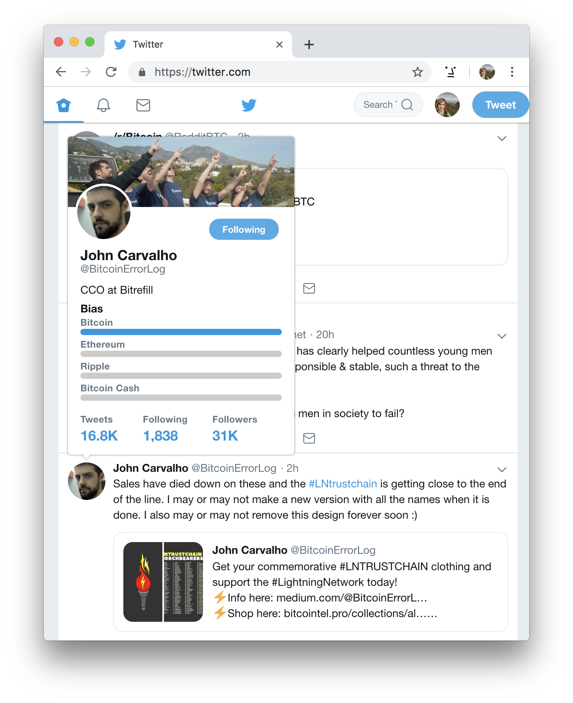

# Coinflict of Interest

> Browser extension to show user biases on Crypto Twitter.

There are lots of people voicing their opinions on Crypto Twitter, however it's often hard to work out if Tweets are genuinely informative, or if the person has an ulterior motive.

The step I usually use to determine how seriously I should take a Tweet are:

- See a negative tweet about a certain currency.
- Check that person’s profile to see if they're biased towards or against that currency.
- If they’re biased towards it and they’re saying something negative, it’s probably a valid criticism.
- If they’re biased against it and they’re saying something negative, it might just be FUD.

However this can be time consuming and it isn't always easy to tell someone's biases just by glancing at their profile.

This browser extension helps you get quick insights into user biases by injecting the data straight into Twitter. Bias information is displayed inside the users profile card that pops up when you hover over their avatar. It's also displayed under a users bio on their profile.

## Build from Source

### `yarn`

Install dependencies

### `yarn build`

Build the unpacked extension into the `dist` directory.

## License

MIT © Luke Childs
